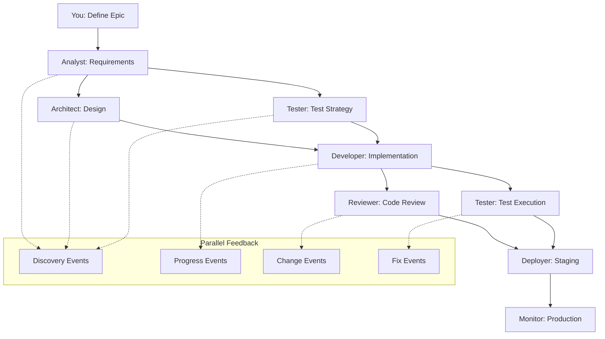
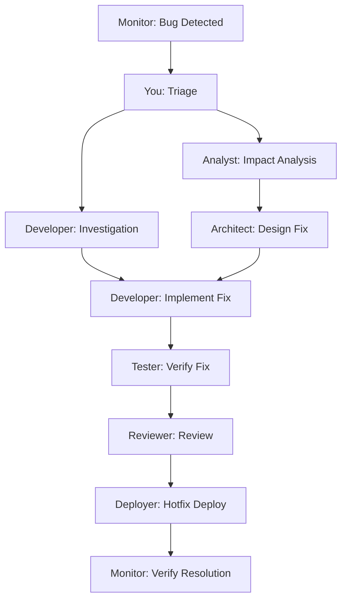

# Parallel Sub-Agent Orchestration Framework

## Core Concept
**Orchestrated Parallelism** - Sub-agents work simultaneously on their specialized tasks while maintaining synchronized state through a central orchestration layer that you control.

## 🎭 Orchestration Architecture

### Central Command Structure
```
    ┌─────────────────────┐
    │   YOU (Conductor)   │
    │  - Final decisions  │
    │  - Priority setting │
    │  - Conflict resolution │
    └──────────┬──────────┘
               │
    ┌──────────▼──────────┐
    │  Orchestration Hub  │
    │  - State management │
    │  - Event routing    │
    │  - Progress tracking│
    └──────────┬──────────┘
               │
    ┌──────────▼──────────┐
    │    Message Bus      │
    │  - Real-time sync   │
    │  - Event streaming  │
    │  - Notification hub │
    └─────────────────────┘
```

## 🔄 Parallel Workflow Design

### Phase-Based Parallelism
Instead of sequential phases, agents work in **overlapping waves** with continuous feedback:

| Time → | T1 | T2 | T3 | T4 | T5 | T6 | T7 | T8 |
|--------|----|----|----|----|----|----|----|----|
| **Analyst** | ████ | ████ | ░░░░ | ░░░░ | ████ | ████ | ░░░░ | ░░░░ |
| **Architect** | ░░░░ | ████ | ████ | ████ | ░░░░ | ████ | ████ | ░░░░ |
| **Tester** | ░░░░ | ░░░░ | ████ | ████ | ████ | ████ | ████ | ████ |
| **Developer** | ░░░░ | ░░░░ | ░░░░ | ████ | ████ | ████ | ████ | ████ |
| **Reviewer** | ░░░░ | ░░░░ | ░░░░ | ░░░░ | ████ | ████ | ████ | ████ |
| **Deployer** | ░░░░ | ░░░░ | ░░░░ | ░░░░ | ░░░░ | ░░░░ | ████ | ████ |
| **Monitor** | ░░░░ | ░░░░ | ░░░░ | ░░░░ | ░░░░ | ░░░░ | ░░░░ | ████ |

**Legend**: ████ = Active work | ░░░░ = Standby/feedback mode

## 🏗 Technical Infrastructure

### 1. Orchestration Hub (Central State)
```yaml
# orchestration-config.yml
project_state:
  current_phase: "development"
  active_agents: ["analyst", "architect", "developer", "tester"]
  blocked_agents: []
  
agent_status:
  analyst:
    status: "active"
    current_task: "user_story_refinement"
    progress: 75
    last_update: "2025-08-05T10:30:00Z"
    dependencies: []
    
  architect:
    status: "waiting"
    current_task: "api_design"
    progress: 50
    last_update: "2025-08-05T10:25:00Z"
    dependencies: ["analyst.requirements_complete"]

shared_artifacts:
  requirements: "linear://project/requirements"
  architecture: "figma://system-design"
  code_base: "github://repo/main"
  test_suite: "playwright://test-results"
```

### 2. Message Bus (Real-time Communication)
```typescript
// Event-driven communication system
interface AgentEvent {
  from: AgentType;
  to: AgentType | 'all' | 'orchestrator';
  type: 'discovery' | 'progress' | 'change' | 'fix' | 'blocked';
  payload: any;
  timestamp: Date;
  priority: 'low' | 'medium' | 'high' | 'critical';
}

// Example events
const events = [
  {
    from: 'analyst',
    to: 'architect',
    type: 'discovery',
    payload: { new_requirement: 'OAuth integration needed' },
    priority: 'high'
  },
  {
    from: 'tester',
    to: 'developer',
    type: 'fix',
    payload: { failing_test: 'API response validation' },
    priority: 'critical'
  }
];
```

### 3. Shared State Management
```json
{
  "project_context": {
    "requirements": {
      "version": "1.2",
      "last_updated": "analyst",
      "status": "approved",
      "artifacts": ["prd.md", "user_stories.json"]
    },
    "architecture": {
      "version": "2.1",
      "last_updated": "architect", 
      "status": "in_review",
      "artifacts": ["system_design.fig", "api_spec.yml"]
    },
    "implementation": {
      "version": "3.4",
      "last_updated": "developer",
      "status": "in_progress",
      "artifacts": ["src/", "package.json"]
    }
  }
}
```

## 🎯 Agent Interaction Protocols

### 1. Discovery Events
When any agent discovers something new that affects others:

```yaml
discovery_protocol:
  trigger: "Agent finds new information"
  action: "Broadcast discovery event"
  recipients: "Relevant downstream agents"
  
  example:
    - analyst discovers new requirement
    - architect gets notified to update design
    - tester gets notified to update test strategy
    - developer gets notified about scope change
```

### 2. Progress Events
Continuous progress updates for coordination:

```yaml
progress_protocol:
  frequency: "Every 15 minutes or at milestone completion"
  content:
    - current_task: "What they're working on"
    - completion_percentage: "How much is done"
    - blockers: "What's stopping them"
    - next_milestone: "What's coming next"
    - dependencies_needed: "What they need from others"
```

### 3. Change Events
When requirements, design, or implementation changes:

```yaml
change_protocol:
  trigger: "Modification to shared artifacts"
  impact_analysis: "Auto-calculate affected agents"
  approval_required: "From orchestrator (you)"
  
  workflow:
    1. Change proposed by agent
    2. Impact analysis runs
    3. Affected agents notified
    4. You approve/reject/modify
    5. Change propagated to all agents
```

### 4. Fix Events
When issues are discovered that need immediate attention:

```yaml
fix_protocol:
  priority_levels:
    critical: "Blocks other agents, immediate attention"
    high: "Affects quality, fix within 1 hour"
    medium: "Technical debt, fix within 1 day"
    low: "Nice to have, fix when convenient"
    
  escalation:
    - Agent attempts fix
    - If blocked, escalates to relevant agent
    - If still blocked, escalates to orchestrator
```

## 🎛 Your Orchestration Dashboard

### Real-time Control Panel
```
┌─────────────────────────────────────────────────────────────┐
│                    Project: Vibe-Coding-App                 │
├─────────────────────────────────────────────────────────────┤
│ Status: Development Phase | Progress: 67% | Issues: 2 High  │
├─────────────────────────────────────────────────────────────┤
│                                                             │
│ ACTIVE AGENTS                          PENDING DECISIONS    │
│ ┌─────────────┐ ┌─────────────┐        ┌─────────────────┐  │
│ │ Analyst     │ │ Developer   │        │ API Design      │  │
│ │ ████████░░  │ │ ██████░░░░  │        │ Needs approval  │  │
│ │ 80% - Active│ │ 60% - Active│        │ [Approve][Edit] │  │
│ └─────────────┘ └─────────────┘        └─────────────────┘  │
│                                                             │
│ ┌─────────────┐ ┌─────────────┐        RECENT EVENTS       │
│ │ Architect   │ │ Tester      │        ┌─────────────────┐  │
│ │ ██████████  │ │ ████░░░░░░  │        │ 10:45 - New req │  │
│ │ 100%-Review │ │ 40% - Active│        │ 10:30 - Test fix│  │
│ └─────────────┘ └─────────────┘        │ 10:15 - Deploy  │  │
│                                        └─────────────────┘  │
└─────────────────────────────────────────────────────────────┘
```

### Control Commands
```bash
# Your orchestration commands
/status                    # Overall project status
/agent <name> status       # Specific agent status
/pause <agent>            # Pause an agent
/resume <agent>           # Resume an agent
/priority <task> <level>  # Change task priority
/approve <decision>       # Approve pending decisions
/escalate <issue>         # Escalate an issue
/sync                     # Force sync all agents
```

## 🔄 Parallel Workflows

### Workflow 1: New Feature Development


### Workflow 2: Bug Fix Process


## 📋 Implementation Structure

### 1. Agent Workspace Setup
```
project/
├── orchestration/
│   ├── hub/                 # Central state management
│   ├── message-bus/         # Event system
│   ├── dashboard/           # Your control interface
│   └── config/             # Agent configurations
├── agents/
│   ├── analyst/            # Requirements agent workspace
│   ├── architect/          # Design agent workspace  
│   ├── developer/          # Code agent workspace
│   ├── tester/            # Test agent workspace
│   ├── reviewer/          # Review agent workspace
│   ├── deployer/          # Deploy agent workspace
│   └── monitor/           # Monitor agent workspace
└── shared/
    ├── artifacts/         # Shared documents/designs
    ├── state/            # Project state
    └── templates/        # Reusable templates
```

### 2. Agent Communication APIs
```typescript
// Each agent implements these interfaces
interface Agent {
  id: string;
  status: 'active' | 'waiting' | 'blocked' | 'paused';
  
  // Core methods
  receiveEvent(event: AgentEvent): Promise<void>;
  sendEvent(event: AgentEvent): Promise<void>;
  updateProgress(progress: ProgressUpdate): Promise<void>;
  getStatus(): AgentStatus;
  
  // Work methods
  startTask(task: Task): Promise<void>;
  pauseTask(): Promise<void>;
  resumeTask(): Promise<void>;
  completeTask(): Promise<TaskResult>;
}

// Orchestrator interface for your control
interface Orchestrator {
  getAllAgents(): Agent[];
  getProjectStatus(): ProjectStatus;
  pauseAgent(agentId: string): Promise<void>;
  resumeAgent(agentId: string): Promise<void>;
  approveDecision(decisionId: string): Promise<void>;
  escalateIssue(issueId: string): Promise<void>;
  forceSync(): Promise<void>;
}
```

### 3. Event Routing Rules
```yaml
routing_rules:
  discovery_events:
    analyst_discovery: ["architect", "tester"] 
    architect_discovery: ["developer", "tester", "deployer"]
    tester_discovery: ["developer", "reviewer"]
    
  progress_events:
    broadcast_to: "orchestrator"
    frequency: "every_15_minutes"
    
  change_events:
    requires_approval: true
    approval_timeout: "1_hour"
    auto_notify: "affected_agents"
    
  fix_events:
    critical: "immediate_escalation"
    high: "notify_relevant_agents"
    medium: "queue_for_next_cycle"
```

## 🎯 Your Role as Orchestrator

### Daily Orchestration Tasks
- **Morning**: Review overnight progress, approve pending decisions
- **Midday**: Check agent status, resolve conflicts, adjust priorities  
- **Evening**: Review completed work, plan next day's focus

### Decision Points You Control
1. **Scope changes**: Approve/reject new requirements
2. **Architecture decisions**: Choose between design alternatives
3. **Priority conflicts**: Decide what gets worked on first
4. **Resource allocation**: Which agents focus on what
5. **Quality gates**: When to proceed to next phase
6. **Risk mitigation**: How to handle blockers

### Escalation Handling
```yaml
escalation_matrix:
  technical_conflict:
    between: ["architect", "developer"]
    your_role: "Final technical decision"
    
  requirement_ambiguity:
    between: ["analyst", "architect", "developer"]
    your_role: "Clarify business intent"
    
  quality_vs_speed:
    between: ["reviewer", "deployer"]
    your_role: "Balance business needs"
    
  resource_constraint:
    between: "any_agents"
    your_role: "Prioritize and allocate"
```

## 🚀 Implementation Roadmap

### Phase 1: Infrastructure (Week 1-2)
- [ ] Set up message bus system
- [ ] Create orchestration hub
- [ ] Build your control dashboard
- [ ] Configure agent workspaces

### Phase 2: Agent Integration (Week 3-4)
- [ ] Implement agent communication protocols
- [ ] Set up event routing
- [ ] Create shared state management
- [ ] Test parallel workflows

### Phase 3: Orchestration Tools (Week 5-6)
- [ ] Build control commands
- [ ] Create decision approval flows
- [ ] Implement escalation systems
- [ ] Add monitoring and alerts

### Phase 4: Optimization (Week 7-8)
- [ ] Fine-tune parallel timing
- [ ] Optimize event routing
- [ ] Enhance your dashboard
- [ ] Document orchestration patterns

---

This framework gives you **complete control** while enabling **maximum parallelism**. Each agent works independently but stays synchronized through the central orchestration layer that you manage. You get real-time visibility into everything and final decision authority on all critical choices.

Ready to implement any specific part of this orchestration system?