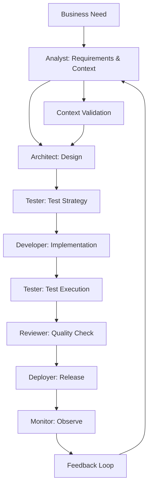

# Vibe-Coding: Modular Development Lifecycle Framework v2

## Core Philosophy
**"Think hard, keep it simple"** - A repeatable pattern that orchestrates cutting-edge dev tools through specialized sub-agents, with swappable components and test-driven everything.

## Architecture Overview

### 🎯 Sub-Agent Roles
| Agent | Responsibility | Primary Tools | MCP Integration |
|-------|---------------|---------------|-----------------|
| **Analyst** | Requirements gathering, context setting, stakeholder alignment | Linear, Notion, Figma, Miro | Requirements tracking server |
| **Architect** | System design, patterns, tech stack decisions | Claude Code, Cursor, architecture diagrams | Design review server |
| **Developer** | Implementation, code generation, refactoring | Claude Code, GitHub Copilot, Cursor | Code generation server |
| **Tester** | Test strategy, test generation, coverage analysis | Vitest, Playwright, Jest, Cypress | Test execution server |
| **Reviewer** | Code quality, security, performance analysis | SonarQube, CodeClimate, ESLint, Prettier | Code analysis server |
| **Deployer** | CI/CD, infrastructure, monitoring | Docker, GitHub Actions, Vercel, AWS | Deployment server |
| **Monitor** | Performance tracking, error handling, analytics | Sentry, DataDog, New Relic | Monitoring server |

### 🔄 Development Lifecycle Flow



## 🛠 Tool Stack (Swappable Components)

### Requirements & Context
- **Primary**: Linear + Notion + Figma
- **Alternatives**: Jira + Confluence + Sketch, GitHub Issues + Wiki + Excalidraw
- **User Research**: Amplitude, Hotjar, FullStory
- **Documentation**: Notion (swappable: GitBook, Obsidian, Coda)

### IDE & Development
- **Primary**: Cursor + Claude Code
- **Alternatives**: VSCode + Copilot, JetBrains + AI Assistant
- **Terminal**: Warp with AI features

### Testing Framework
- **Unit**: Vitest (swappable: Jest, Mocha)
- **Integration**: Playwright (swappable: Cypress, Selenium)
- **E2E**: Playwright + Docker containers
- **Performance**: Lighthouse CI, WebPageTest

### Code Quality
- **Linting**: ESLint + Prettier (swappable: Biome)
- **Type Safety**: TypeScript (swappable: Flow, JSDoc)
- **Security**: Snyk, OWASP ZAP
- **Performance**: Bundle analyzers, profilers

### DevOps & Deployment
- **Containerization**: Docker + Docker Compose
- **CI/CD**: GitHub Actions (swappable: GitLab CI, CircleCI)
- **Hosting**: Vercel (swappable: Netlify, AWS, Railway)
- **Monitoring**: Sentry + Vercel Analytics

### MCP Servers
- **Requirements**: Linear/Notion MCP server
- **Design**: Figma/Miro MCP server
- **File Operations**: Filesystem MCP
- **Git Integration**: Git MCP server
- **Database**: Postgres/SQLite MCP
- **API Testing**: HTTP client MCP
- **Deployment**: Cloud provider MCP servers

## 📊 Requirements Expression Framework

### 🎯 Analyst Agent Tools & Methods

#### Primary Requirements Tools
| Tool | Purpose | Format | Integration |
|------|---------|--------|-------------|
| **Linear** | Issue tracking, roadmap, priorities | Structured tickets, epics | API + MCP server |
| **Notion** | Context docs, PRDs, user stories | Rich text, databases | API + embed codes |
| **Figma** | User flows, wireframes, prototypes | Visual designs, components | Plugin + MCP server |
| **Miro** | User journey mapping, brainstorming | Interactive boards | API integration |

#### Requirements Expression Formats
```yaml
# Example: User Story Template
story:
  as_a: "Product Manager"
  i_want: "Automated deployment pipeline"
  so_that: "Features reach users faster with less risk"
  
acceptance_criteria:
  - "Deployments complete in under 5 minutes"
  - "Rollback capability within 30 seconds"
  - "Zero-downtime for users"
  
context:
  business_value: "Reduce deployment time by 80%"
  user_impact: "Faster feature delivery"
  technical_constraints: ["Must work with Vercel", "Budget < $100/month"]
```

#### Context Setting Templates
- **Business Requirements Document (BRD)**
- **Product Requirements Document (PRD)**
- **Technical Requirements Document (TRD)**
- **User Journey Maps**
- **API Specifications (OpenAPI/Swagger)**

## 📋 Enhanced Execution Framework

### Phase 0: Requirements & Context
- [ ] **Analyst** gathers business requirements
- [ ] **Analyst** creates user stories and acceptance criteria
- [ ] **Analyst** maps user journeys and pain points
- [ ] **Analyst** defines success metrics and constraints
- [ ] **Analyst** validates context with stakeholders

### Phase 1: Setup & Architecture
- [ ] **Architect** reviews requirements and context
- [ ] Initialize project with modular config
- [ ] Set up swappable tool configurations
- [ ] Create sub-agent prompt templates
- [ ] Configure MCP server connections

### Phase 2: Development Loop
- [ ] **Architect** defines system design based on requirements
- [ ] **Tester** creates test specifications from acceptance criteria
- [ ] **Developer** implements with TDD
- [ ] **Reviewer** ensures quality gates
- [ ] **Deployer** handles release pipeline

### Phase 3: Monitoring & Iteration
- [ ] **Monitor** tracks performance against success metrics
- [ ] **Analyst** analyzes user feedback and usage data
- [ ] Feedback loop triggers requirement updates
- [ ] Tool evaluation and swapping
- [ ] Pattern refinement

## 🔧 Enhanced Modular Configuration

### Tool Swap Mechanism
```yaml
# vibe-config.yml
requirements:
  primary: [linear, notion, figma]
  alternatives: [jira, confluence, sketch], [github-issues, wiki, excalidraw]
  
testing:
  primary: vitest
  alternatives: [jest, mocha]
  
deployment:
  primary: vercel
  alternatives: [netlify, railway, aws]
  
ai_assistant:
  primary: claude-code
  alternatives: [copilot, cursor-ai]
```

### Enhanced Sub-Agent Templates

#### Analyst Agent Prompt
```markdown
You are the Analyst Agent responsible for:
- Gathering and clarifying requirements
- Setting proper context for the development team
- Creating user stories with clear acceptance criteria
- Validating assumptions with stakeholders
- Maintaining the source of truth for project requirements

Tools available: Linear, Notion, Figma, Miro
Output format: Structured requirements documents, user stories, wireframes
Quality gates: Stakeholder approval, clear acceptance criteria, measurable success metrics
```

#### Architect Agent Prompt
```markdown
You are the Architect Agent responsible for:
- Translating requirements into technical design
- Making technology stack decisions
- Defining system architecture and patterns
- Creating technical specifications
- Ensuring scalability and maintainability

Tools available: Claude Code, Cursor, Miro, Draw.io
Output format: Architecture diagrams, technical specs, technology recommendations
Quality gates: Technical feasibility, scalability assessment, security review
```

#### Developer Agent Prompt
```markdown
You are the Developer Agent responsible for:
- Implementing features based on technical specifications
- Writing clean, maintainable code
- Following TDD practices
- Collaborating with other agents for quality
- Refactoring and optimization

Tools available: Claude Code, GitHub Copilot, Cursor, various IDEs
Output format: Production-ready code, unit tests, documentation
Quality gates: Test coverage, code review approval, performance benchmarks
```

#### Tester Agent Prompt
```markdown
You are the Tester Agent responsible for:
- Creating comprehensive test strategies
- Writing and maintaining test suites
- Ensuring quality gates are met
- Performance and security testing
- Test automation and CI/CD integration

Tools available: Vitest, Playwright, Jest, Cypress, Lighthouse
Output format: Test plans, automated test suites, quality reports
Quality gates: Test coverage thresholds, performance budgets, security scans
```

#### Reviewer Agent Prompt
```markdown
You are the Reviewer Agent responsible for:
- Code quality assessment
- Security vulnerability analysis
- Performance optimization recommendations
- Compliance and standards enforcement
- Knowledge sharing and best practices

Tools available: SonarQube, CodeClimate, ESLint, Security scanners
Output format: Code review comments, quality reports, improvement recommendations
Quality gates: Quality score thresholds, security clearance, performance standards
```

#### Deployer Agent Prompt
```markdown
You are the Deployer Agent responsible for:
- CI/CD pipeline management
- Infrastructure as code
- Deployment automation
- Environment management
- Release coordination

Tools available: Docker, GitHub Actions, Vercel, AWS, Terraform
Output format: Deployment scripts, infrastructure configs, release notes
Quality gates: Successful deployments, rollback capabilities, environment parity
```

#### Monitor Agent Prompt
```markdown
You are the Monitor Agent responsible for:
- Application performance monitoring
- Error tracking and alerting
- User analytics and behavior tracking
- System health monitoring
- Feedback loop coordination

Tools available: Sentry, DataDog, New Relic, Analytics platforms
Output format: Performance reports, error analyses, user insights
Quality gates: Uptime targets, performance budgets, error rate thresholds
```

## 🎯 Enhanced Success Metrics

### Requirements & Planning
- **Requirements Clarity**: % of stories with clear acceptance criteria
- **Context Accuracy**: Stakeholder satisfaction scores
- **Planning Accuracy**: Estimated vs. actual delivery times

### Development Quality
- **Code Quality**: Test coverage, security score, performance
- **Development Velocity**: Time from idea to production
- **Bug Rate**: Issues found in production vs. development

### Tool & Process Efficiency
- **Tool Efficiency**: Which tools get swapped and why
- **Agent Effectiveness**: Success rate of each sub-agent
- **Process Improvement**: Cycle time reduction over iterations

### Business Alignment
- **Feature Adoption**: Usage vs. predicted impact
- **User Satisfaction**: NPS, retention, engagement metrics
- **Business Value**: ROI on development efforts

## 🔄 Requirements Feedback Loop

### Continuous Improvement Cycle
1. **Monitor** feeds usage data back to **Analyst**
2. **Analyst** updates requirements based on real user behavior
3. **Architect** adjusts system design for emerging needs
4. Continuous validation of assumptions and context
5. Tool stack optimization based on performance data

### Feedback Channels
- **User Analytics**: Amplitude, Hotjar, FullStory
- **Performance Data**: Core Web Vitals, error rates, response times
- **Business Metrics**: Conversion rates, user engagement, revenue impact
- **Team Feedback**: Retrospectives, tool satisfaction surveys

## 🚀 Implementation Roadmap

### Week 1-2: Foundation Setup
- [ ] Define project structure and configuration
- [ ] Set up MCP servers and tool integrations
- [ ] Create sub-agent prompt templates
- [ ] Establish communication protocols

### Week 3-4: Agent Development
- [ ] Implement Analyst workflows
- [ ] Set up Architect decision frameworks
- [ ] Configure Developer toolchains
- [ ] Establish Tester automation

### Week 5-6: Integration & Optimization
- [ ] Connect all agents in workflow
- [ ] Test end-to-end processes
- [ ] Optimize tool configurations
- [ ] Refine quality gates

### Week 7-8: Monitoring & Iteration
- [ ] Deploy monitoring systems
- [ ] Establish feedback loops
- [ ] Run first full project cycle
- [ ] Document lessons learned

## 📚 Additional Resources

### Documentation Templates
- Requirements gathering checklists
- Architecture decision records (ADRs)
- Test strategy templates
- Deployment runbooks
- Monitoring dashboards

### Training Materials
- Sub-agent role guides
- Tool integration tutorials
- Best practices documentation
- Troubleshooting guides

---

**Version**: 2.0  
**Last Updated**: August 2025  
**Status**: Ready for Implementation

This framework provides a comprehensive, modular approach to development that can scale with your needs while maintaining quality and velocity. Each component is designed to be swappable, allowing for continuous improvement and adaptation to new tools and methodologies.